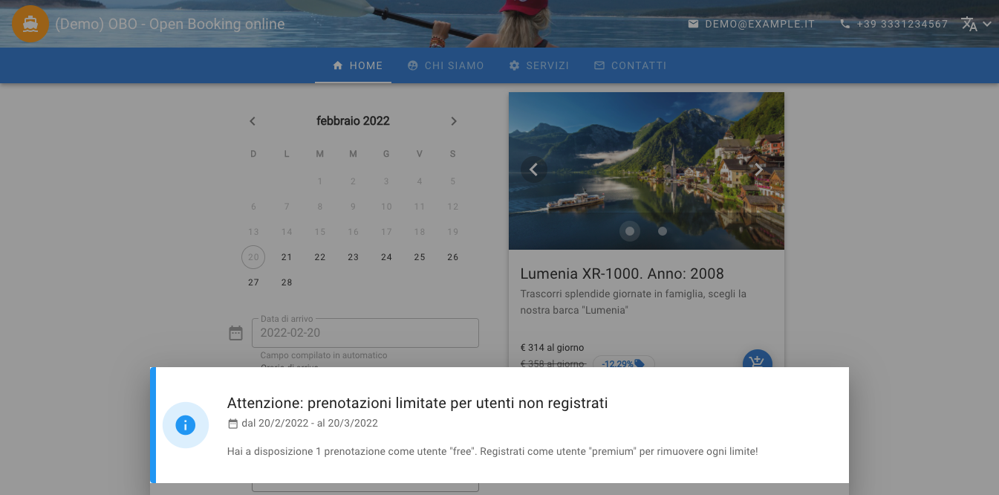
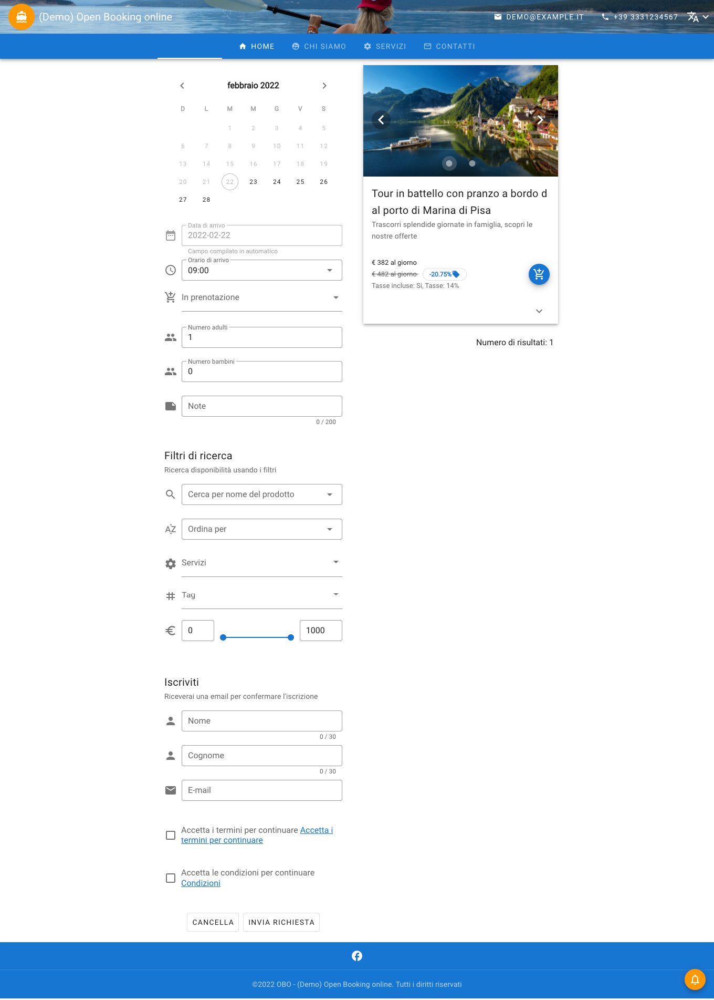
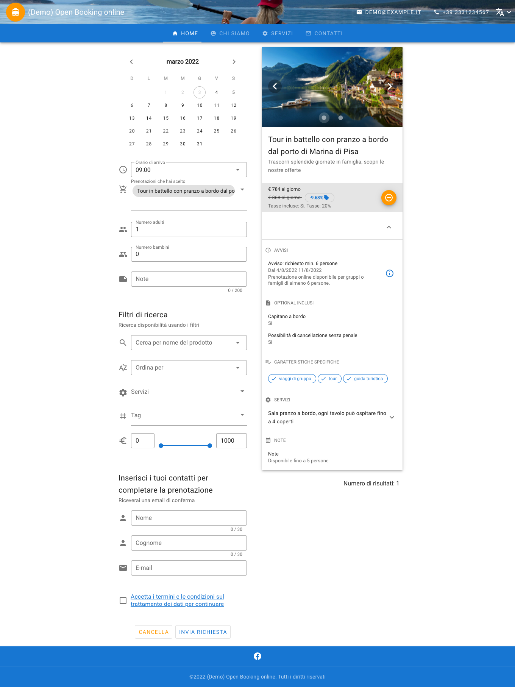
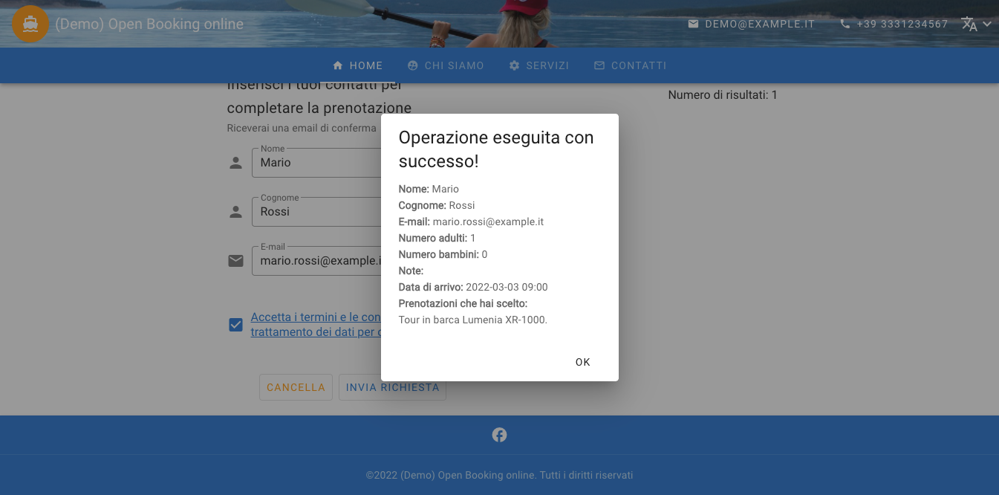

# vuejs-calendar

## Project setup
```
npm install
```
use nodejs version 16 LTS

### Compiles and hot-reloads for development
```
npm run serve
```

### Compiles and minifies for production
```
npm run build
```

### Lints and fixes files
```
npm run lint
```

### Customize configuration
See [Configuration Reference](https://cli.vuejs.org/config/).

## API Services
### Mock API request/response model
The default settings use a simulated api response template, if you want to use a real API request/response you need to edit the ".env" file and enter the api URL which implements the data model suggested by the file [opeanapi3](doc/openapi.3.0.2.yml). 
> This project does not implement server side backend api services 

### Environment
VUE_APP_NODE_ENV: see "src/common/enum.js", use "demo" to use mock api

VUE_APP_TITLE=```string```

VUE_APP_API_BASE_URL=```url``` (example: http://localhost/api/)

VUE_APP_API_BOOKING=```string``` (example: booking)

VUE_APP_API_CONTENTS=```string``` (example: contents)

VUE_APP_API_DATA=```string``` (example: app)

VUE_APP_API_ENTITIES=```string``` (example: entities)

VUE_APP_LINK_PRIVACY_TERM=```url```

VUE_APP_LINK_PRIVACY_CONDITION=```url```

VUE_APP_LINK_PRIVACY_POLICY=```url```

VUE_APP_API_PER_PAGE=```number```

VUE_APP_API_KEY=```string```

## Icons
[mdi](https://pictogrammers.github.io/@mdi/font/5.4.55/)

[material-design-icons-iconfont](https://jossef.github.io/material-design-icons-iconfont/)

## Post build
[cli.vuejs.org](https://cli.vuejs.org/guide/deployment.html)

## CHANGE THEME COLOR
Edit file [colors](src/common/colors.js)

## DEMO TEMPLATE




